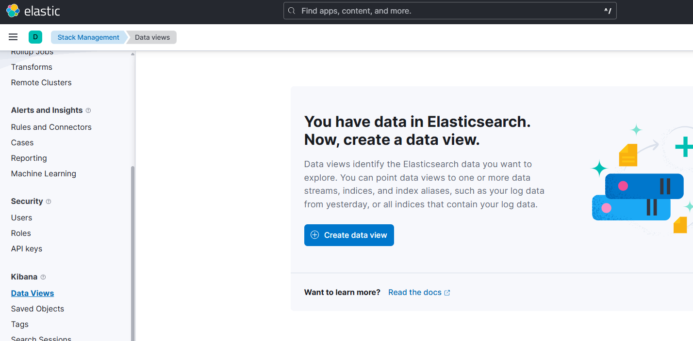
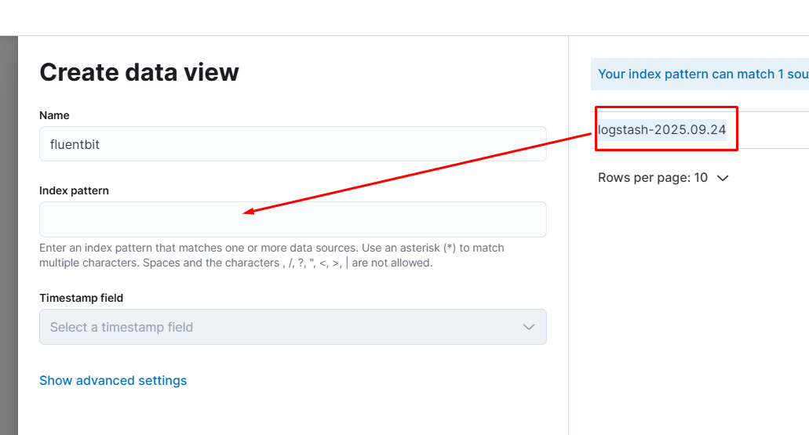
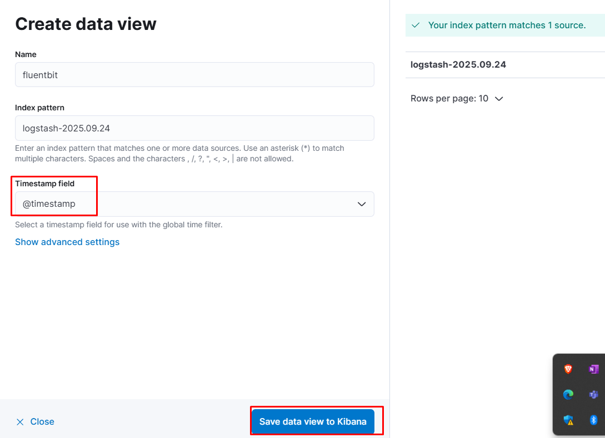
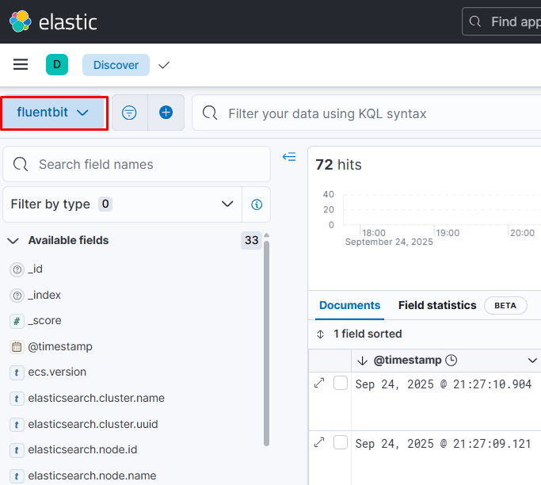

# EFK Stack

In this repo we will make a small project to be deployed in your home lab for testing.

There are two ways covered in this repo:

1- Elastic Operator then elasticsearch clusters. 
*(Better in real or bigger environment)*

2- Direct elasticsearch cluster. *(Suits local test)*

## 1- Elasticsearch Operator

### Operator

You might need to consider increasing default value of `vm.max_map_count` before deploying the operator on your worker nodes.

```bash
sysctl -w vm.max_map_count=262144
```
Deploy the operator
```bash
helm repo add elastic https://helm.elastic.co
helm repo update
helm install -n elasticsearch --create-namespace elastic-operator elastic/eck-operator -n elasticsearch -f eck-operator-values.yaml
```

While waiting for the operator to be `Ready`, you may need to preper and pvc specified for snapshot.

```bash
# I used nfs
kubectl -n elasticsearch apply -f backup-pv.yaml
```

Also I deployed a nfs-autoprovisioner for the data

### ES cluster
```bash
kubectl -n elasticsearch apply -f cluster.yaml
```

## 2- Elasticsearch

Use helm to deploy elasticsearch cluster with only one master node
```bash
helm repo add elastic https://helm.elastic.co

helm install elasticsearch elastic/elasticsearch \
  --namespace elasticsearch \
  --set replicas=1 \
  --set resources.requests.memory=1Gi \
  --set resources.requests.cpu=500m \
  --set volumeClaimTemplate.resources.requests.storage=5Gi
```

Get admin username and password to use in the following steps
```bash
kubectl get secrets --namespace=elasticsearch elasticsearch-master-credentials -ojsonpath='{.data.username}' | base64 -d
kubectl get secrets --namespace=elasticsearch elasticsearch-master-credentials -ojsonpath='{.data.password}' | base64 -d
```

## Kibana (Dashboard)

```bash
helm install kibana elastic/kibana \
  --namespace elasticsearch \
  --set service.type=LoadBalancer
```

Then open http://localhost:5601 and try to acces using the creds for the last step.

## FluenBit

```bash
helm install fluent-bit fluent/fluent-bit -f values.yaml -n elasticsearch
```

## Workload Example

Let's create job with simple logs to detect in the elastic

```bash
kubectl create ns test
kubectl apply -f job.yaml -n test
```

Now in the UI kibana go to: Stack Management > Data View > Add Data. Name it, Then make the index is logstash -just copy logstash line from the right column.



While adding the data you should see index pattern: `logstash-2025.09.24` 



If not, so there is an issue with flunetbit sending logs to elastic



Then start watching you logs



## Snapshots

It's much better to use snapshot by elasticsearch REST API.
Also you may need to use a cronjob to do it daily, but what about your storage!, you need to set a retention policy. In my case, I set it daily keeping only the last 3 days snapshots and remove the older ones.

```bash
kubectl apply -f cronjob.yaml -n elasticsearch
```

> It might be better to test each line in the cronjob manually befor deploying

> Also, the date may vary in both case manually -Your timezone- and automatically -GMT zone-, as the curlimage's date is set to +00:00

# References:
* https://github.com/elastic/helm-charts/tree/main
* https://www.elastic.co/docs/api/doc/elasticsearch/operation/operation-snapshot-create
* https://docs.fluentbit.io/manual/installation/downloads/kubernetes

